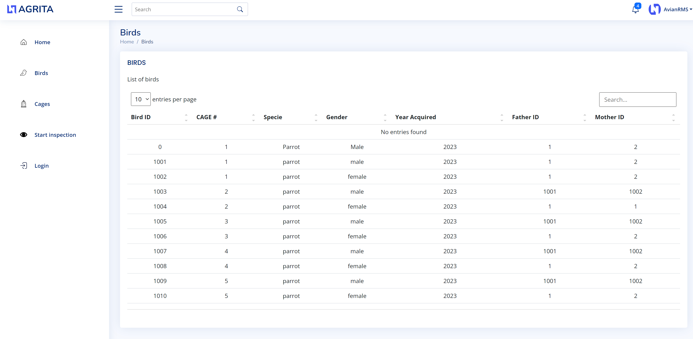

## AvianRMS

AvianRMS (Avian Record Management System) is a simple Go-based application for managing bird records and cages. It allows you to create, retrieve, update, and delete bird, cage, brood and chick data in a relational database.

### Main bits of the project
* Main File
* Database Package
* Handlers Package
* Models Package
* Frontend Package

### Structure of the project
```
.
├── README.md
├── avianrms.db
├── db
│   └── db.go
├── frontend
│   └── omitted
├── go.mod
├── go.sum
├── handlers
│   └── handlers.go
├── main.go
└── models
    └── models.go
```

### Features

- Create and manage bird records.
- Create and manage cage records.
- Create and manage brood records.
- Create and manage chick records.
- Associate birds with cages.
- Store data about bird species, gender, year of acquisition, and parent birds.
- Track cage status, breeding birds, timestamps, cleaning requirements, egg count, chick count, and notes.

### Usage
You can interact with the AvianRMS application by making HTTP requests to various endpoints. The following API endpoints are available:

#### Endpoints
- **/create-bird**: Create a new bird record.
- **/get-bird**: Retrieve bird records.
- **/update-bird**: Update an existing bird record.
- **/delete-bird**: Delete a bird record.
- **/create-cage**: Create a new cage record.
- **/get-cage**: Retrieve cage records.
- **/get-all-cages**: Retrieve all cage records.
- **/update-cage**: Update an existing cage record.
- **/delete-cage**: Delete a cage record.

### Getting Started
Before you begin, ensure you have met the following requirements:

#### Requirements
- Go (version 1.16 or higher)
- SQLite (version 3 or higher)

#### Installation

1. Clone the repository:

   ```shell
   git clone <repository-url>

2. Install the dependencies:

   ```shell
   go mod download

3. Create the SQLite database:

   ```shell
   sqlite3 avianrms.db < schema.sql

### Run the server
Start the server with `go run main.go` command.
    
The server is configured to run on `http://localhost:8080` by default. If you want to change the host or port, modify the main.go file.

The server will respond with a JSON format that represents the data structure of an object in the application.

```json
{
    "ID": 1,
    "Status": "BP",
    "BreedingBird1ID": 1,
    "BreedingBird2ID": 2,
    "Timestamp": "2023-09-09T12:34:56Z",
    "CleaningRequired": false,
    "EggsCurr": 3,
    "ChicksCurr": 1,
    "Notes": "Some notes here"
}
```

### Examples

1. To create a new bird, use the following curl command as an example:

    Example:

    ```shell
    curl -X POST -d "CageID=1&Specie=Parrot&Gender=Male&YearAcquired=2023&FatherBirdID=1&MotherBirdID=2" http://localhost:8080/create-bird


2. Retrieving Birds. To retrieve a list of all birds or a specific bird by ID, you can use the following curl commands:

    Example:

    - Get all birds:
        ```shell
        curl http://localhost:8080/get-bird


    - Get a specific bird by ID (replace 123 with the desired bird ID):
        ```shell
        curl http://localhost:8080/get-bird?id=123


3. Updating a Bird. To update the information of an existing bird, make a PUT request to `/update-bird` with the following parameters:

- **ID**: The ID of the bird to update.
- **CageID**: The updated cage ID.
- **Specie**: The updated species.
- **Gender**: The updated gender.
- **YearAcquired**: The updated year of acquisition.
- **FatherBirdID**: The updated father's ID.
- **MotherBirdID**: The updated mother's ID.

    Example:

    ```shell
    curl -X PUT -d "ID=123&CageID=2&Specie=Cockatoo&Gender=Female&YearAcquired=2022&FatherBirdID=3&MotherBirdID=4" http://localhost:8080/update-bird


4. Deleting a Bird. To delete a bird by ID (replace 123 with the desired bird ID), make a DELETE request to `/delete-bird`:

    Example:

    ```shell
    curl -X DELETE http://localhost:8080/delete-bird?id=123


5. Creating a Cage. To create a new cage, make a POST request to `/create-cage` with the following parameters:

- **Status**: The status of the cage (options: BP/SM/SF).
- **BreedingBird1ID**: The ID of the first breeding bird.
- **BreedingBird2ID**: The ID of the second breeding bird.
- **CleaningRequired**: Boolean indicating if cleaning is required.
- **EggsCurr**: The current number of eggs in the cage.
- **ChicksCurr**: The current number of chicks in the cage.
- **Notes**: Additional notes about the cage.

    Example:

    ```shell
    curl -X POST -d "Status=BP&BreedingBird1ID=1&BreedingBird2ID=2&CleaningRequired=false&EggsCurr=3&ChicksCurr=1&Notes=SomeNotes" http://localhost:8080/create-cage


6. Retrieving Cages. To retrieve a list of all cages or a specific cage by ID, you can use the following curl commands:

    Example:

    - Get all cages:
        ```shell
        curl http://localhost:8080/get-all-cages

    - Get a specific cage by ID (replace 123 with the desired cage ID):
        ```shell
        curl http://localhost:8080/get-cage?id=123


7. Updating a Cage. To update the information of an existing cage, make a PUT request to `/update-cage` with the following parameters:

- **ID**: The ID of the cage to update.
- **Status**: The status of the cage (options: BP/SM/SF).
- **BreedingBird1ID**: The ID of the first breeding bird.
- **BreedingBird2ID**: The ID of the second breeding bird.
- **CleaningRequired**: Boolean indicating if cleaning is required.
- **EggsCurr**: The current number of eggs in the cage.
- **ChicksCurr**: The current number of chicks in the cage.
- **Notes**: Additional notes about the cage.

    Example:

    ```shell
    curl -X PUT -d "ID=123&Status=SM&BreedingBird1ID=3&BreedingBird2ID=4&CleaningRequired=true&EggsCurr=5&ChicksCurr=2&Notes=UpdatedNotes" http://localhost:8080/update-cage


8. Deleting a Cage. To delete a cage by ID (replace 123 with the desired cage ID), make a DELETE request to `/delete-cage`:

    Example:

    ```shell
    curl -X DELETE http://localhost:8080/delete-cage?id=123


### Frontend Interface

The AvianRMS application also includes a web-based frontend that allows users to interact with the system through a user-friendly interface. This frontend provides a graphical way to manage and view bird and cage data.

### Accessing the Frontend

To access the frontend, follow these steps:

1. Ensure that the AvianRMS backend server is running on your local machine or a remote server as described in the [Usage](#usage) section.

2. Open your web browser and enter the following URL: `http://localhost:8080`. Replace `localhost:8080` with the appropriate hostname and port if you are running the backend on a remote server.

### Current Features

The current version of the frontend interface offers the following features:

- Birds and Cages Overview
- Cage check-up 

### Planned Future Features

In future releases, we plan to introduce the following features to the frontend interface:

- Create new bird and cage entries.
- Update existing bird and cage records.
- Delete birds and cages.
- Perform various queries and searches.

Explore the intuitive frontend to manage your avian data with ease!



## Feedback and Issues

If you encounter any issues or have feedback regarding the frontend interface, please don't hesitate to [create an issue](https://github.com/mdolin/avianrms/issues) on our GitHub repository.
